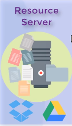
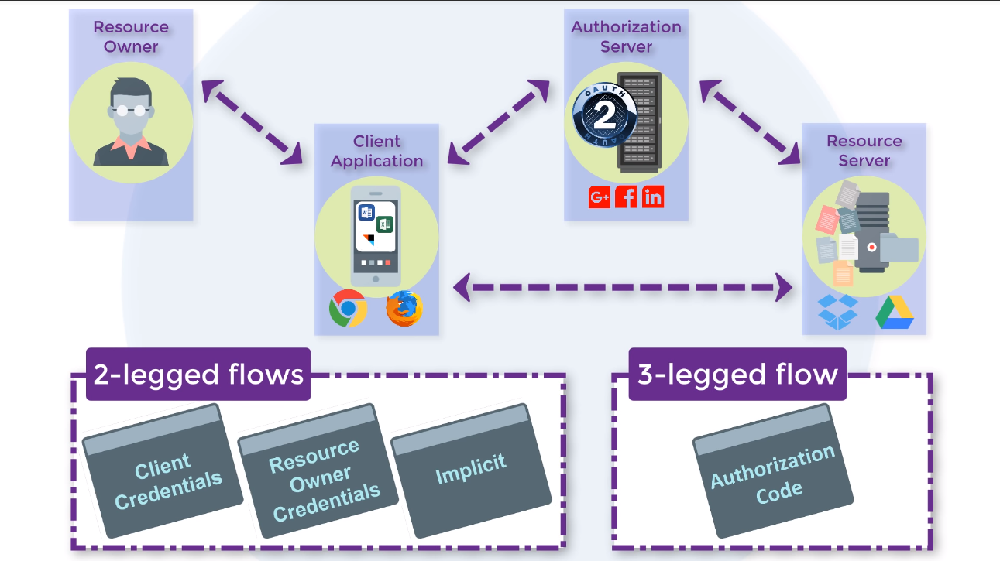

# Keycloak 


Note:
    http://webpro.github.io/reveal-md/
    reveal-md Readme.md  -w
    # add C:\Program Files (x86)\Nodist\bin\node_modules\reveal-md\lib\print.js "" over ${printPluginPath}
    reveal-md Readme.md --static ./docs
    "http://localhost:1948/archi.keycloak.prez.md?print-pdf" => print chrome

----
## RH-SSO

RedHat supported version of Keycloak.

----
* Production ready
    * compatibility
* Maintainability
    * 1 minor release a year (2019- 7.3)
    * 3 major releases a year (2019 - 7.0, 6.0, 5.0)

---
## Why delegate security layer?


----
* Open source
* security skills
* extended features
* provided updates

Note:
    Gatekeeper
    I'm expert i code my login page for mobile apps, Kerberos
    expert not infallible

----

* Cost
    * integration over development
    * configuration

---
## IAM: security component


Note:
    IAM
----

* Authentication (AuthN)
* Authorization (AuthZ)
* Auditing
* Administration

Note:
    identification
    role
    Traçabilité
    Maintenabilité
----
### Definition

* Single Sign On (SSO)
* Single Log Out (SLO)


----
## Authentication/Authorization mechanisms

----

### Basic Auth


----

* Easy integration

*Authorization Basic Base64(user:password)*

----
* 1 query -> 1 authentication check
    * DDoS attack
* Unencrypted password (HTTPS)
    * Password interception
* Authorization only    

----

## OAuth 2.0


----
* Released in 2006: 2.0
* Oriented simplicity

Note:
    IETF OAuth Working Group.

----
* High security flows
    * use token (limited lifetime)
    * n queries -> 1 password transmission
* 1 query -> 1 token check

----
* JSON Web Tokens

```
eyJhbGciOiJIUzI1NiIsInR5cCI6IkpXVCJ9.
eyJzdWIiOiIxMjM0...iaWF0IjoxNTE2MjM5MDIyfQ.
SflKxwRJSMeKKF2QT4fwpMeJf36POk6yJV_adQssw5c
```

----
```
{
  "alg": "HS256",
  "typ": "JWT"
}
{
  "sub": "1234567890",
  "name": "John Doe",
  "admin": true
}
HMACSHA256(
  base64UrlEncode(header) + "." +
  base64UrlEncode(payload),
  secret)
```

----
* Large adoption

Google, Facebook, ...


----
* More complex to integrate
* No authentication information
    * No SSO or SLO
    * No standard API for identity

----
### OpenID Connect


----

* Developed by OpenID Foundation
    * modern use cases
* Released in 2014: 1.0
* OpenID Connect is an identity layer on top of the OAuth 2.0.


Note:
    SPA
    Mobile
    Microservice

----

* OAuth 2.O
* IDToken (JWT tokens) (user info  + API)
* Discovery and self registration
* SSO/ SLO
* Back/Front channel
* Identity broker (google, delegation)
* n query -> 1 password transmission
* 1 query -> authorization + authentication

Note:
    JWT -> pronounce JOT
    integrity no confidential

----

* More complex to integrate

----

### Security Assertion Markup Language 2.0

* Developed by OASIS (consortium)
* Released in 2005: 2.0
* Authentication (AuthN)
* Authorization (AuthZ)

----
* Tested and feedback

* Complex to integrate

---

## Supported mechanisms
----
  
* OAuth 2.0
* SAML 2.0
* OpenID Connect 1.0

---

## Focus on OIDC

----

### Glossary
----

#### Elements
----

##### Realm


Note:
    Territoire
    Who are you? Rights ? Dress code
----

##### Client


Note:
    Configuration liée à une application ou une famille d'appli
    
----
##### Role


Note: 
    Droit

----
##### Claims


Note: 
    Attribut déclaré
    2FA phone number
    ##### Scope
    

----

#### OIDC actors
----


Note:
    Consommateur ou propriétaire de la resource
----


Note:
    Façade gérant le flux d'authentification
----



Note:
    Serveur de ressources (confonfu avec le RP) 

----


Note:
    Keycloak: gestionnaire
    https://www.youtube.com/watch?v=6DxRTJN1Ffo
    https://www.youtube.com/watch?v=1ZX7554l8hY

----

### OIDC Grants


Note:
    acteurs communiquent pour former un processus d'authentification et d'authorisation

----



Note:
    2 étapes ou 3 étapes

----

#### Access type
----


----

----

#### Channel
----


----

### Grants

----

### Client credentials (2)


Note:
    compte de service
    client -> confidential -> secret

----

```

- post:
    url: "/auth/realms/{{ realm }}/protocol/openid-connect/token"
    body:   'grant_type=client_credentials&
            client_id={{ cliendId }}&
            client_secret={{ secret }}'
    capture:
    - json: "$.access_token"
    - json: "$.refresh_token"
```  

Note: 
    access token
    refresh token

----

```
- post:
    url: "/auth/realms/{{ realm }}/protocol/openid-connect/userinfo"
    headers:
      "Authorization": "Bearer {{ access_token }}"
```

----

### Resource owner credentials (2)

grant_type: password

Note:
    Legacy compatibility
    Basic auth

----


----

### Implicit (2)


Note:
    Access token + IDToken direct
    without refresh token
    token in redirect_uri

----

### Authorization Code (3)


----

[Demo](https://openidconnect.net/)

Note:
    admin https://xxx/auth/admin/master/console/#/realms
    Config:
        https://xxx/auth/realms/demo/protocol/openid-connect/auth

        https://xxx/auth/realms/demo/.well-known/openid-configuration
        client: public
    https://tools.ietf.org/html/rfc7517    
    * kid: identifiant de la clé    
    * access
    * refresh
    * IDToken
    * Offline Token
    * Claims
    --> Hybrid
    Implicit / Authorization
    The authorization server will respond with both a code (which the client can exchange for tokens on a secure channel) and a token. A common use case for the hybrid flow is using the code to get an access token on the server, and directly consuming an ID token on the client.

---

### Integration guideline

----

##### Flow

----

|                   | Authorization code | Client  credentials | Resource owner
|---                | ---                | ---                 | ---
|Web App (Template) |        |                     | 
|SPA                |              |                     | 
|Backend (API)      |                    |               | 
|Mobile             |        |                     | 
|CLI                |                    |                     | 

Note:
    * Implicit: No refresh token, access token long life
        * token in redirect_uri
    * Resource owner credentials: legacy or CLI

----

|                   | Authorization code | Client  credentials | Resource owner
|---                | ---                | ---                 | ---
|Web App (Template) | confidential       |                     | 
|SPA                |              |                     | 
|Backend (API)      |                    |             | 
|Mobile             |        |                     | 
|CLI                |                    |                     | 

Note:
    * Implicit: No refresh token, access token long life
        * token in redirect_uri
    * Resource owner credentials: legacy or CLI

----

|                   | Authorization code | Client  credentials | Resource owner
|---                | ---                | ---                 | ---
|Web App (Template) | confidential       |                     | 
|SPA                | public             |                     | 
|Backend (API)      |                    |              | 
|Mobile             |        |                     | 
|CLI                |                    |                     | 

Note:
    * Implicit: No refresh token, access token long life
        * token in redirect_uri
    * Resource owner credentials: legacy or CLI

----

|                   | Authorization code | Client  credentials | Resource owner
|---                | ---                | ---                 | ---
|Web App (Template) | confidential       |                     | 
|SPA                | public             |                     | 
|Backend (API)      |                    | API Key             | 
|Mobile             |        |                     | 
|CLI                |                    |                     | 

Note:
    * Implicit: No refresh token, access token long life
        * token in redirect_uri
    * Resource owner credentials: legacy or CLI

----

|                   | Authorization code | Client  credentials | Resource owner
|---                | ---                | ---                 | ---
|Web App (Template) | confidential       |                     | 
|SPA                | public             |                     | 
|Backend (API)      |                    | API Key             | 
|Mobile             | confidential       |                     | 
|CLI                |                    |                     | 

Note:
    * Implicit: No refresh token, access token long life
        * token in redirect_uri
    * Resource owner credentials: legacy or CLI

----

|                   | Authorization code | Client  credentials | Resource owner
|---                | ---                | ---                 | ---
|Web App (Template) | confidential       |                     | 
|SPA                | public             |                     | 
|Backend (API)      |                    | API Key             | 
|Mobile             | confidential       |                     | 
|CLI                | public             |                     | compatibility

Note:
    * Implicit: No refresh token, access token long life
        * token in redirect_uri
    * Resource owner credentials: legacy or CLI
        
----
##### Architecture / Security

----
**use ONLY OIDC standard endpoints**

*(exclude Keycloak admin API use)*


Note:
    Portability
    adhérence avec faible Keycloak
    Security

----

**define UNIQUE responsibility and UNIQUE owner for data**

*(unique user reference)*


Note:
    limit complexity
    easy architecture

----

|                                   | Keycloak              | Application         |
|---                                | ---                   | ---                 |
|New microservice (light)           | users,roles,claims    | (1)                 |
|New microservice (complex)         |                  |   |
|Legacy application                 |                    |   |

Note:
    (1) No user management UI
    (2) Synchronization (user: full, roles/claims: partial)

----

|                                   | Keycloak              | Application         |
|---                                | ---                   | ---                 |
|New microservice (light)           | users,roles,claims    | (1)                 |
|New microservice (complex)         | (2)                   | users,roles,claims  |
|Legacy application                 | (2)                   | users,roles,claims  |

Note:
    (1) No user management UI
    (2) Synchronization (user: full, roles/claims: partial)    

----

**split public and private resources**

*(Front office for administration and another for customers = 2 APIs)*


 
----
**One realm by security strategy**


Note:
    Password rule, expiration

----
**One application container by realm**


Note:
    NOT 1 container -> 2 realms
    domain architecture


----
**One style guide by realm**

*(Unique corporate identity for login and email)*


----
**Clean and easy users management**


----
* Mandatory, unique, case insensitive username
* Mandatory, unique, case insensitive and validated email address
* Efficient and limited roles definition
* Limited claims definition
    (not use personal data if not  necessary)

----
**Developer platform**
*(docker image + dev shared profile)*


----

##### Business

----

**Business domains and trademarks isolation**


Note:
    SSO Monetique Luma
    While label isolated
 
----
**Limit account duplication**


Note:
    Internal realm

---

## Extensions
----

### Theme


----
### Federation
----


---

## Adapters
----

* Java
* JBossEAP/Wildfly
* Spring
* NodeJS
----

* Keycloak GateKeeper

Note:
    Architecture

----

* API Gateway
* Service Mesh

---


---


